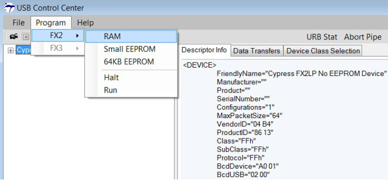

# Bulkloop example

  代码位置：C:\Cypress\USB\CY3684_EZ-USB_FX2LP_DVK\1.1\Firmware\Bulkloop

# 参考文档

  `C:\Cypress\USB\CY3684_EZ-USB_FX2LP_DVK\1.1\Documentation\EZ-USB(R) Development Kit User Guide.pdf`

# 更改源码

  直接编译的代码USB Control Center不能识别，所以需要进行更改。

  https://community.cypress.com/thread/13140

* `C:\Cypress\USB\CY3684_EZ-USB_FX2LP_DVK\1.1\Firmware\Bulkloop\Fx2.h`

  ```
  // #define ENABLE_7_SEG_DISPLAY
  extern int start_7_seg_display;
  ```

# 烧录代码

  用Keil打开并编译。

  

# 设备描述符

* Descriptor Info

  ```
  <DEVICE>
	FriendlyName="Cypress FX2LP Sample Device"
	Manufacturer="Cypress"
	Product="EZ-USB"
	SerialNumber=""
	Configurations="1"
	MaxPacketSize="64"
	VendorID="04 B4"
	ProductID="10 04"
	Class="00h"
	SubClass="00h"
	Protocol="00h"
	BcdDevice="00 00"
	BcdUSB="02 00"
	<CONFIGURATION>
		Configuration="0"
		ConfigurationValue="1"
		Attributes="80h"
		Interfaces="1"
		DescriptorType="2"
		DescriptorLength="9"
		TotalLength="32"
		MaxPower="50"
		<INTERFACE>
			Interface="0"
			InterfaceNumber="0"
			AltSetting="0"
			Class="FFh"
			Subclass="00h"
			Protocol="0"
			Endpoints="2"
			DescriptorType="4"
			DescriptorLength="9"
			<ENDPOINT>
				Type="BULK"
				Direction="OUT"
				Address="02h"
				Attributes="02h"
				MaxPktSize="512"
				DescriptorType="5"
				DescriptorLength="7"
				Interval="0"
			</ENDPOINT>
			<ENDPOINT>
				Type="BULK"
				Direction="IN"
				Address="86h"
				Attributes="02h"
				MaxPktSize="512"
				DescriptorType="5"
				DescriptorLength="7"
				Interval="0"
			</ENDPOINT>
		</INTERFACE>
	</CONFIGURATION>
</DEVICE>

  ```

* source code

  descpritor info的内容和dscr.a51的内容对应。

```
  ;;-----------------------------------------------------------------------------
;;   File:      dscr.a51
;;   Contents:  This file contains descriptor data tables.
;;
;; $Archive: /USB/Examples/Fx2lp/bulkloop/dscr.a51 $
;; $Date: 9/01/03 8:51p $
;; $Revision: 3 $
;;
;;
;;-----------------------------------------------------------------------------
;; Copyright 2003, Cypress Semiconductor Corporation
;;-----------------------------------------------------------------------------;;-----------------------------------------------------------------------------
   
DSCR_DEVICE   equ   1   ;; Descriptor type: Device
DSCR_CONFIG   equ   2   ;; Descriptor type: Configuration
DSCR_STRING   equ   3   ;; Descriptor type: String
DSCR_INTRFC   equ   4   ;; Descriptor type: Interface
DSCR_ENDPNT   equ   5   ;; Descriptor type: Endpoint
DSCR_DEVQUAL  equ   6   ;; Descriptor type: Device Qualifier

DSCR_DEVICE_LEN   equ   18
DSCR_CONFIG_LEN   equ    9
DSCR_INTRFC_LEN   equ    9
DSCR_ENDPNT_LEN   equ    7
DSCR_DEVQUAL_LEN  equ   10

ET_CONTROL   equ   0   ;; Endpoint type: Control
ET_ISO       equ   1   ;; Endpoint type: Isochronous
ET_BULK      equ   2   ;; Endpoint type: Bulk
ET_INT       equ   3   ;; Endpoint type: Interrupt

public      DeviceDscr, DeviceQualDscr, HighSpeedConfigDscr, FullSpeedConfigDscr, StringDscr, UserDscr

DSCR   SEGMENT   CODE PAGE

;;-----------------------------------------------------------------------------
;; Global Variables
;;-----------------------------------------------------------------------------
      rseg DSCR      ;; locate the descriptor table in on-part memory.

DeviceDscr:   
      db   DSCR_DEVICE_LEN      ;; Descriptor length
      db   DSCR_DEVICE   ;; Decriptor type
      dw   0002H      ;; Specification Version (BCD)
      db   00H        ;; Device class
      db   00H         ;; Device sub-class
      db   00H         ;; Device sub-sub-class
      db   64         ;; Maximum packet size
      dw   0B404H      ;; Vendor ID
      dw   0410H      ;; Product ID (Sample Device)
      dw   0000H      ;; Product version ID
      db   1         ;; Manufacturer string index
      db   2         ;; Product string index
      db   0         ;; Serial number string index
      db   1         ;; Number of configurations

DeviceQualDscr:
      db   DSCR_DEVQUAL_LEN   ;; Descriptor length
      db   DSCR_DEVQUAL   ;; Decriptor type
      dw   0002H      ;; Specification Version (BCD)
      db   00H        ;; Device class
      db   00H         ;; Device sub-class
      db   00H         ;; Device sub-sub-class
      db   64         ;; Maximum packet size
      db   1         ;; Number of configurations	; ÅäÖÃÃèÊö·ûµÄÊýÁ¿
      db   0         ;; Reserved

HighSpeedConfigDscr:   
      db   DSCR_CONFIG_LEN               ;; Descriptor length
      db   DSCR_CONFIG                  ;; Descriptor type
      db   (HighSpeedConfigDscrEnd-HighSpeedConfigDscr) mod 256 ;; Total Length (LSB)
      db   (HighSpeedConfigDscrEnd-HighSpeedConfigDscr)  /  256 ;; Total Length (MSB)
      db   1      ;; Number of interfaces
      db   1      ;; Configuration number
      db   0      ;; Configuration string
      db   10000000b   ;; Attributes (b7 - buspwr, b6 - selfpwr, b5 - rwu)
      db   50      ;; Power requirement (div 2 ma)

;; Interface Descriptor                                      ;½Ó¿ÚÃèÊö·û
      db   DSCR_INTRFC_LEN      ;; Descriptor length
      db   DSCR_INTRFC         ;; Descriptor type
      db   0               ;; Zero-based index of this interface
      db   0               ;; Alternate setting
      db   2               ;; Number of end points 
      db   0ffH            ;; Interface class
      db   00H               ;; Interface sub class
      db   00H               ;; Interface sub sub class
      db   0               ;; Interface descriptor string index
      
;; Endpoint Descriptor                                      ;¶ËµãÃèÊö·û
      db   DSCR_ENDPNT_LEN      ;; Descriptor length
      db   DSCR_ENDPNT         ;; Descriptor type
      db   02H               ;; Endpoint number, and direction
      db   ET_BULK            ;; Endpoint type
      db   00H               ;; Maximun packet size (LSB)
      db   02H               ;; Max packect size (MSB)
      db   00H               ;; Polling interval

;; Endpoint Descriptor
      db   DSCR_ENDPNT_LEN      ;; Descriptor length
      db   DSCR_ENDPNT         ;; Descriptor type
      db   86H               ;; Endpoint number, and direction
      db   ET_BULK            ;; Endpoint type
      db   00H               ;; Maximun packet size (LSB)
      db   02H               ;; Max packect size (MSB)
      db   00H               ;; Polling interval

HighSpeedConfigDscrEnd:   

FullSpeedConfigDscr:   
      db   DSCR_CONFIG_LEN               ;; Descriptor length
      db   DSCR_CONFIG                  ;; Descriptor type
      db   (FullSpeedConfigDscrEnd-FullSpeedConfigDscr) mod 256 ;; Total Length (LSB)
      db   (FullSpeedConfigDscrEnd-FullSpeedConfigDscr)  /  256 ;; Total Length (MSB)
      db   1      ;; Number of interfaces
      db   1      ;; Configuration number
      db   0      ;; Configuration string
      db   10000000b   ;; Attributes (b7 - buspwr, b6 - selfpwr, b5 - rwu)
      db   50      ;; Power requirement (div 2 ma)

;; Interface Descriptor
      db   DSCR_INTRFC_LEN      ;; Descriptor length
      db   DSCR_INTRFC         ;; Descriptor type
      db   0               ;; Zero-based index of this interface
      db   0               ;; Alternate setting
      db   2               ;; Number of end points 
      db   0ffH            ;; Interface class
      db   00H               ;; Interface sub class
      db   00H               ;; Interface sub sub class
      db   0               ;; Interface descriptor string index
      
;; Endpoint Descriptor
      db   DSCR_ENDPNT_LEN      ;; Descriptor length
      db   DSCR_ENDPNT         ;; Descriptor type
      db   02H               ;; Endpoint number, and direction
      db   ET_BULK            ;; Endpoint type
      db   40H               ;; Maximun packet size (LSB)
      db   00H               ;; Max packect size (MSB)
      db   00H               ;; Polling interval

;; Endpoint Descriptor
      db   DSCR_ENDPNT_LEN      ;; Descriptor length
      db   DSCR_ENDPNT         ;; Descriptor type
      db   86H               ;; Endpoint number, and direction
      db   ET_BULK            ;; Endpoint type
      db   40H               ;; Maximun packet size (LSB)
      db   00H               ;; Max packect size (MSB)
      db   00H               ;; Polling interval

FullSpeedConfigDscrEnd:   

StringDscr:

StringDscr0:   
      db   StringDscr0End-StringDscr0      ;; String descriptor length
      db   DSCR_STRING
      db   09H,04H
StringDscr0End:

StringDscr1:   
      db   StringDscr1End-StringDscr1      ;; String descriptor length
      db   DSCR_STRING
      db   'C',00
      db   'y',00
      db   'p',00
      db   'r',00
      db   'e',00
      db   's',00
      db   's',00
StringDscr1End:

StringDscr2:   
      db   StringDscr2End-StringDscr2      ;; Descriptor length
      db   DSCR_STRING
      db   'E',00
      db   'Z',00
      db   '-',00
      db   'U',00
      db   'S',00
      db   'B',00
StringDscr2End:

UserDscr:      
      dw   0000H
      end
``` 
