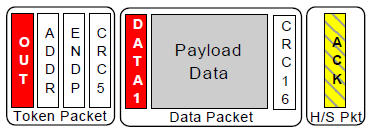

# USB包的种类

1. Token 令牌包

  令牌包用来启动一次USB传输。USB是主从结构，所有的数据传输都是由主机发起的，设备只能被动接听数据。

  令牌包有四种:  

* 输出令牌包，用来通知设备将要输出一个数据包。 

* 输入令牌包，用来通知设备返回一个数据包。  

* 建立令牌包，只用在控制传输中，跟输出令牌包作用一样。也是通知设备将要输出一个数据包。  

  setup令牌包后只是用DATA0数据包，且只能发到设备控制端点，并且设备必须要接收，而OUT令牌包没有这些限制。

* 帧起始包，在每帧开始时发送，以广播形式发送，所有USB全速设备和告诉设备都可以接收SOF包。

2. Data 数据包  

  用来传输数据的。USB1.1中，只有DATA0包和DATA1包。USB2.0中又增加了DATA2和MDATA包。主要用在高速分裂事务和高速宽同步传输中。

3. Handshake 握手包

  用来表示一个传输是否被对方确认。握手包有四种：

* ACK表示正确接收数据，并且有足够空间来容纳数据，主机和设备都可以用ACK。而NAK，STALL，NYET只有设备能够返回。

* NAK表示没有数据需要返回，或者数据正确接收但是没有足够空间来容纳他们。

* STALL表示设备无法执行这个请求，或者端点已经被挂起。表示一种错误状态，设备返回STALL后，需要主机进行干预才能接触这种STALL状态。

* NYET只在USB2.0的告诉设备输出事务中使用，它表示设备本次数据成功接收，但是没有足够空间来接收下一次数据。

4. Special 特殊包

  共四种，PRE， ERR， SPLIT， PING。

  PRE，ERR，SPLIT是令牌包，PING是握手包。

  PRE通知集线器打开其低速端口的一种前导包。

  SPLIT令牌包是高速事务分裂令牌包，通知接线器将高速数据包转为全速或者低速数据包发送给下面的端口。

  ERR握手包是在分裂事务中表示错误使用。

# USB传输类型

USB的四种传输类型:

* 批量传输，

  使用批量事务(bulk transaction).分为三个阶段，令牌包阶段，数据包阶段和握手包阶段。

* 中断传输

  是一种保证查询频率的传输。中断端点在端点描述符中。

  中断传输通常用在数据量不大，但是对时间要求严格的设备中，例如人机接口设备中的鼠标，键盘，轨迹球等。

* 等时传输，

  用在数据量大， 对实时性要求高的场合，例如音频设备，视频设备等。这些设备对数据延时很敏感。

* 控制传输，
  
  控制传输分为三个过程：第一个是建立过程，第二个是可选的数据过程，第三个是状态过程。 

# USB枚举过程

* usb主机检测到USB设备插入，先对设备进行复位。  

  * usb设备在总线复位后其地址为0，这样主机就可以通过地址0和那些刚刚插入的设备通信。  

  * usb主机往地址为0的设备端点0发送获取设备描述符的标准请求。

  * 设备收到请求，在数据过程将设备描述符返回给主机。

  * 主机在成功获取到一个数据包的设备描述符并且确认没有错误后，返回一个0长度的确认数据包。

* 主机对设备有一次复位，进入到设置地址阶段。

  * USB主机往地址为0的设备的端点0发出一个设置地址请求，新的设备地址包含在简历过程数据包中。

  * USB主机会分配一个唯一的地址给刚接入的设备。

  * USB设备在收到建立过程之后，进入到状态过程。

  * 设备等待主机请求状态返回，收到输入令牌后，设备返回0长度的状态数据包。

  * 如果主机确认该状态包已经收到，就会发送应答包ACK给设备，设备收到ACK之后，启用新的设备地址。

* 主机再次获取设备描述符。这次和第一次有点不一样，不再使用地址0来访问设备，而是新的设备地址。

* 主机获取配置描述符。配置描述符总共为9字节。主机在获取到配置描述符后，根据配置描述符中所描述的配置集合总长度，获取配置集合。

# USB事务

  事务通常由两个或者三个包组成：令牌包，数据包和握手包。

  令牌包用来启动一个事务，总是由主机发送。

  数据包传送数据，可以主机到设备，也可以设备到主机，方向用令牌包来指定。

  握手包的发送者通常为数据接受者

  
