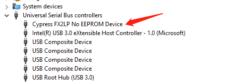

# Quick Start

# 开发步骤

* 安装开发工具

  [CY3684 EZ-USB FX2LP Development Kit](https://www.cypress.com/documentation/development-kitsboards/cy3684-ez-usb-fx2lp-development-kit)

  **CY3684 EZ-USB FX2LP DVK Setup (Kit Design Files, Kiel IDE,GPIF Designer, Host applications, Documentation, Examples)**

* 查看quick start文档:

  安装目录: **C:\Cypress\USB\CY3684_EZ-USB_FX2LP_DVK\1.1\Documentation**，

  参考 **EZ-USB(R) Development Kit User Guide.pdf**。

* 驱动安装

  插上开发板，发现设备识别不了，需要手动安装驱动。

  [Drivers for EZ-USB® FX1™ , FX2LP™ , and FX3™ - KBA94413](https://community.cypress.com/docs/DOC-12366)

